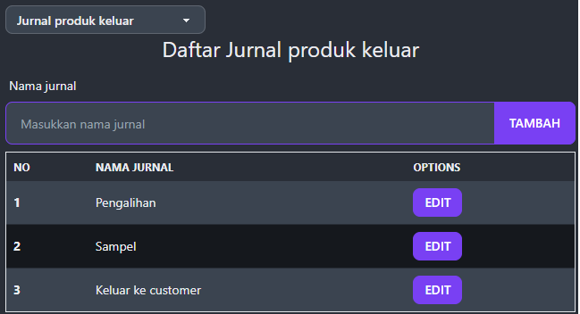
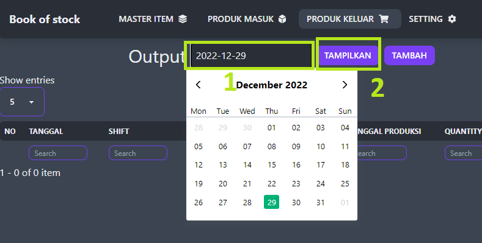
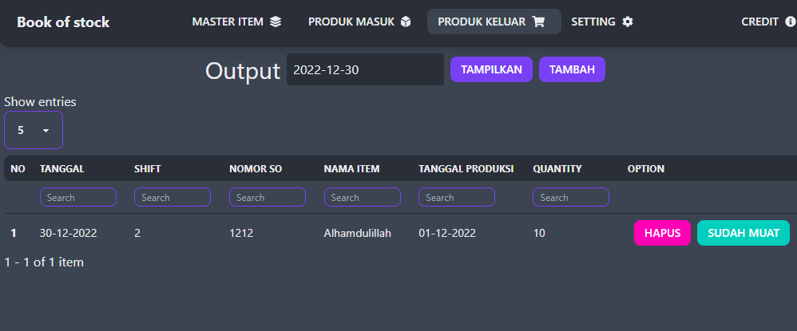

## Bagaimana cara menggunakan aplikasi ini?

Aplikasi ini bisa digunakan sebagai extenstion browser

### Untuk browser chrome :
1. Klik *menu* (3 titik) kemudian masuk ke *More Tools* kemudian pilih *extensions*

2. Aktfkan *developer mode*, klick pada bagian *load upacked*, akan muncul window untuk memilih folder, pilih folder dimana aplikasi ini diletakkan.

3. Buka tab baru, kemudian aplikasi ini akan otomatis tampil.

## Menambahkan type jurnal produk masuk
1. Untuk menambahkan type jurnal produk masuk, pilih menu setting.
2. Pilih jurnal produk masuk pada dropdown.

3. Masukkan nama jurnal kemudian klik tambah atau tekan enter

## Menambahkan type jurnal produk keluar
1. Untuk menambahkan type jurnal produk keluar, pilih menu setting.
2. Pilih jurnal produk keluar pada dropdown.

3. Masukkan nama jurnal kemudian klik tambah atau tekan enter

## Menambahkan item
1. Pilih menu master
2. Masukkan kode item, nama item, masukkan umur produk
3. Kemudian tekan tambah.

## Produk masuk
1. Untuk menampilkan produk masuk, pilih tanggal record untuk ditampilkan, kemudian klick tampilkan.
2. Untuk memambahkan produk masuk klick tombol *tambah*

3. Lengkapi form
4. Untuk menambahkan item, kita perlu memasukkan item satu persatu dengan cara mengisi informasi item (Item, quantity, kode produksi, tanggal produksi, tanggal expired), setelah itu tekan tombol add item

## Produk keluar
1. Untuk menampilkan produk keluar, pilih tanggal record untuk ditampilkan, kemudian klick tampilkan.
2. Untuk memambahkan produk masuk klick tombol *tambah*

3. Lengkapi form
4. Ketikkan nama item atau kode item, setelah memlih item maka akan muncul kolom input baru yang menampilkan tanggal berapa saja yang tersedia digudang untuk item tersebut
5. masukkan quantity, kemudian klick submit.
6. Jika proses muat sudah selesai, klick selesai muat.
7. Jika terdapat ketidak sesuaian antara quantity atau item atau kode produksi yang dimuat, klick hapus, kemudian masukkan kembali produk keluar sesuai dengan produk yang dimuat.
