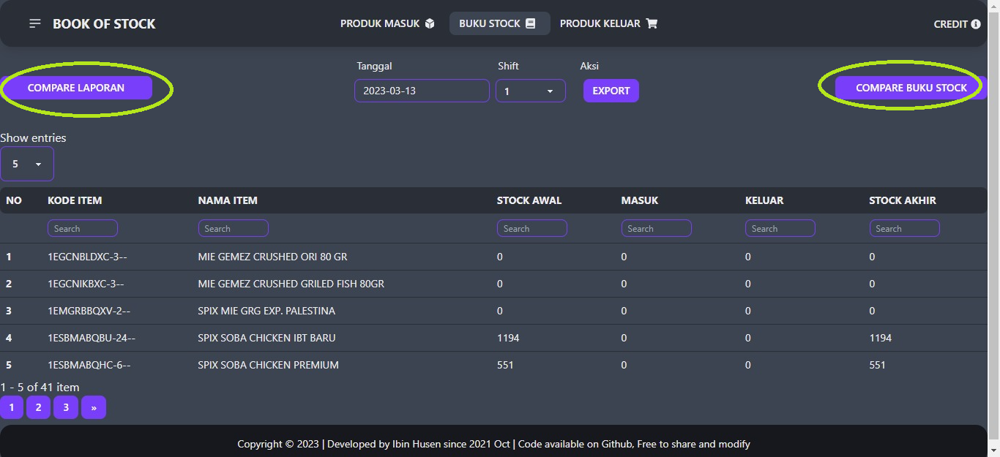

## Pembaruan 16 Maret 2023
<!-- omit in toc -->
- [Pembaruan 16 Maret 2023](#pembaruan-16-maret-2023)
    - [Penampakan aplikasi setelah diperbaharui](#penampakan-aplikasi-setelah-diperbaharui)
  - [Apa saja yang baru](#apa-saja-yang-baru)
  - [Bagaimana cara memperbaharui aplikasi](#bagaimana-cara-memperbaharui-aplikasi)

#### Penampakan aplikasi setelah diperbaharui

### Apa saja yang baru
Pada pembaruan kali ini kami menambahkan fitur dan mengadakan perubahan pada menu buku stock yaitu :

1. Tombol *COMPARE LAPORAN*.
   - Ketika tombol ini diklick, maka user akan diminta untuk meng-upload file laporan harian excel.
   - Setelah file di upload, aplikasi akan membandingkan *saldo akhir* di aplikasi dengan *saldo akhir* yang ada dilaporan harian excel.
   - Setelah proses compare saldo akhir selesai, aplikasi akan menampilkan item mana saja yang saldonya *sesuai*, *tidak sesuai*, dan item yang tidak ditemukan.
   - User dapat *Mengunduh* hasil perbandingan saldo laporan harian VS aplikasi melalui tombol *UNDUH HASIL PERBANDINGAN*.
   - Berikut penampakan proses diatas :
    
2. Tombol *COMPARE BUKU STOCK*.
   - Ketika tombol ini diklick, maka user akan diminta untuk meng-upload file buku stock excel.
   - Setelah file di upload, aplikasi akan membandingkan :
     - *Saldo awal* Aplikasi vs Excel.
     - *Produk masuk shift 1* Aplikasi vs Excel.
     - *Produk keluar shift 1* Aplikasi vs Excel.
     - *Produk masuk shift 2* Aplikasi vs Excel.
     - *Produk keluar shift 2* Aplikasi vs Excel.
     - *Produk masuk shift 3* Aplikasi vs Excel.
     - *Produk keluar shift 3* Aplikasi vs Excel.
     - *Produk keluar shift 4* Aplikasi vs Excel.
     - *Saldo akhir* Aplikasi vs Excel.
   - Setelah proses compare saldo akhir selesai, aplikasi akan menampilkan item mana saja yang *sesuai*, *tidak sesuai*, dan item yang tidak ditemukan.
   - User dapat *Mengunduh* hasil perbandingan saldo laporan harian VS aplikasi melalui tombol *UNDUH HASIL PERBANDINGAN*.
   - Berikut penampakan proses diatas :
    .gif)
    
### Bagaimana cara memperbaharui aplikasi
  - Kunjungi folder aplikasi yang baru.
  - Copy seluruh file yang ada di folder tersebut.
  - Pergi ke folder aplikasi yang dipakai saat ini.
  - Hapus seluruh file didalamnya, kecuali file *manifest.json*.
  - Paste file dari folder aplikasi baru.
  - Kunjungi aplikasi seperti biasa.
  - Jika tidak ada perubahan tekan *Reload* pada browser.

Cukup sampai disini dulu untuk pembaruan aplikasi kali ini, semoga dapat dengan mudah memahami, semoga kedamaian selalu dilimpahkan kepada kita semua.
