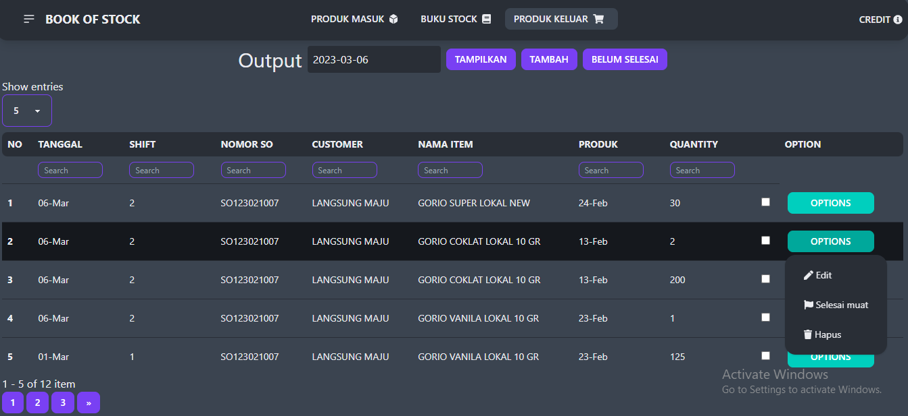

## Pembaruan 06 Maret 2023
<!-- omit in toc -->
- [Pembaruan 06 Maret 2023](#pembaruan-06-maret-2023)
    - [Penampakan aplikasi setelah diperbaharui](#penampakan-aplikasi-setelah-diperbaharui)
  - [Apa saja yang baru](#apa-saja-yang-baru)
  - [Bagaimana cara memperbaharui aplikasi](#bagaimana-cara-memperbaharui-aplikasi)

#### Penampakan aplikasi setelah diperbaharui

### Apa saja yang baru
Pada pembaruan kali ini kami menambahkan fitur dan mengadakan perubahan pada menu produk keluar yaitu :

1. Kami menyembunyikan tombol edit, selesai muat, dan hapus menjadi satu tombol tarik turun *OPTIONS*
2. Kami menambhakan element checkbox untuk pengguna dapat mendandai beberapa record sekaligus
3. Ketika checkbox dicklick maka akan muncul tombol *selesai muat* pada kanan atas.
4. Pengguna dapat memilih tanggal (sekarang/kemarin) dan memilih shift (1/2/3/4) untuk merubah status record menjadi selesai muat sesuai dengan tanggal dan shift yang telah dipilih.

Berikut penampakan proses diatas :

### Bagaimana cara memperbaharui aplikasi
  - Kunjungi folder aplikasi yang baru.
  - Copy seluruh file yang ada di folder tersebut.
  - Pergi ke folder aplikasi yang dipakai saat ini.
  - Hapus seluruh file didalamnya, kecuali file *manifest.json*.
  - Paste file dari folder aplikasi baru.
  - Kunjungi aplikasi seperti biasa.
  - Jika tidak ada perubahan tekan *Reload* pada browser.

Cukup sampai disini dulu untuk pembaruan aplikasi kali ini, semoga dapat dengan mudah memahami, semoga kedamaian selalu dilimpahkan kepada kita semua.
